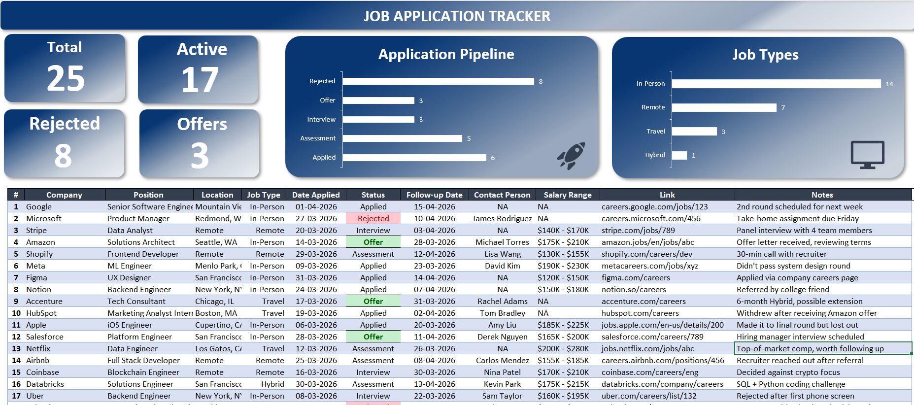

# 📈 Job Application Tracker

A centralized, data-driven dashboard designed to track, manage, and optimize the job hunting process. This tool was born out of personal necessity to eliminate messy spreadsheets and provide clear, actionable insights into application pipelines, interview stages, and offers.

---

## 🔍 About the Project

Searching for a job involves managing multiple timelines, points of contact, and follow-up dates. This project provides a comprehensive visual dashboard that transforms raw application data into strategic insights. 

### Key Features:
* **High-Level Metrics:** Instant visibility into total applications, active processes, rejections, and offers.
* **Application Pipeline:** A visual bar chart tracking your exact stage in the hiring funnel (Applied, Assessment, Interview, Offer, Rejected).
* **Workstyle Distribution:** A breakdown of job types (In-Person, Remote, Hybrid, Travel) to keep alignment with lifestyle preferences.
* **Detailed Log Ledger:** An exhaustive data grid capturing critical details including company names, positions, locations, follow-up dates, salary ranges, and specific interview notes.

---

## 📸 Dashboard Preview

 

---

## 🛠️ Tech Stack

* **Data Management & Visualization:** Microsoft Excel
* **Design & Layout:** Conditional Formatting, Data Validation, and Advanced Charting Tools

---

## 🚀 How to Use

1. **Clone or Download:** Download the tracking excel file.
2. **Log a New Application:** 
   * Fill in the `#`, `Company`, `Position`, and `Location`.
   * Use the dropdown menus to select the `Job Type` and current `Status`.
3. **Keep It Updated:** 
   * Update the `Follow-up Date` as soon as you schedule your next interaction.
   * Add context in the `Notes` section (e.g., "Panel interview with 4 team members").
4. **Monitor the Dashboard:** Use the top analytical cards and graphs to review your pipeline health weekly and adjust your application strategy accordingly.

---

## 👤 Author & Connect

Developed with focus and dedication by **Akhil Garg**. 

Let's connect to talk about development, data tracking, or career opportunities!

* **LinkedIn:** [://linkedin.com](https://www.linkedin.com/in/akhilgarg1/)
 
